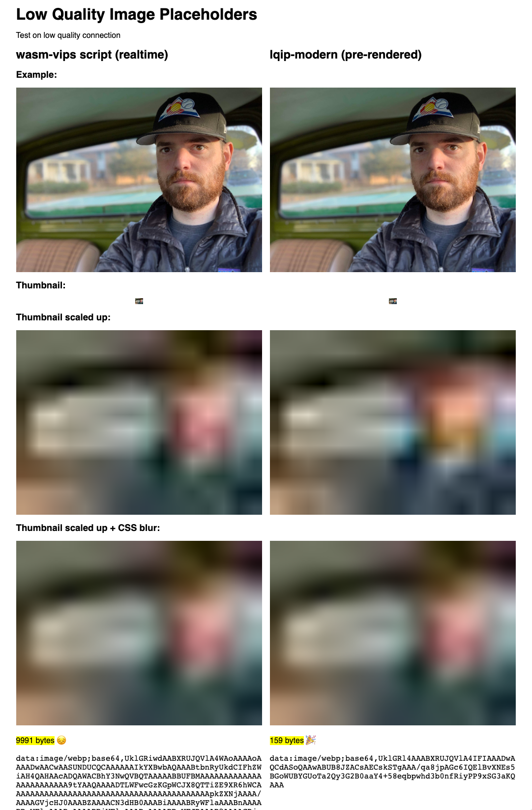

# low quality image placeholder

## create data URIs for low quality image placeholders

### comparing to existing work: `lqip-modern`

https://github.com/transitive-bullshit/lqip-modern/blob/master/index.js

this won't work in a Lambda runtime as it uses `sharp` with native addons⤴

### current progress:

https://party-8nc.begin.app/

## TODO

not use a picture of myself 😬
